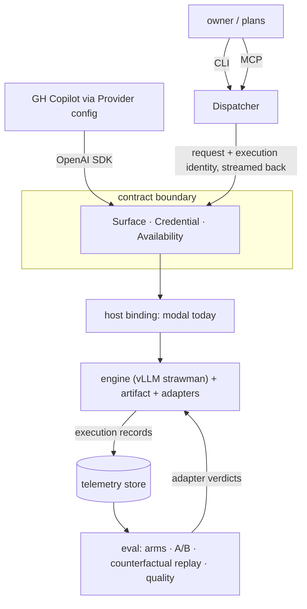

# Strawman architecture

> STATUS: STRAWMAN (agent-scribed 2026-07-17). Every pick below is a default
> erected to be knocked down; the open-rulings table at the end is the list of
> owner decisions this document does NOT make. Vocabulary per
> [vocabulary.md](vocabulary.md); goal numbers per the owner's nine-goal stone.
> Goals in scope here: 1, 2, 4, 5, 6, 8.

## Shape

One sentence per box: the **dispatcher** (goal 1) is ours and mints execution
identity; **Copilot** (goal 2) arrives through the same contract as any other
caller; the **contract boundary** is the only thing both depend on; the **host
binding** (goal 4) places an **engine + adapters** (goal 5) somewhere; every
crossing of the boundary is recorded as an **execution** (goal 8) which the
**eval harness** (goal 6) consumes.

## Components

### Dispatcher (goal 1)
One core, two faces — the scout pattern repeated: a `dispatch` module exposed
as a CLI (`python -m dispatch "..."`) and as MCP tools, both streaming.
Responsibilities: mint execution identity, attach it to the request, stream
the response, append the execution record. Strawman carriage of identity: the
OpenAI `user` field (SDK-native, engines pass it through, appears in engine
logs); alternative: a custom header (cleaner separation, but nonstandard
clients drop it).

### Provider integration (goal 2)
Copilot (CLI/SDK/Chat — disambiguation pending) consumes the executor as a
BYOK-style provider: base URL + key + model names. This constrains the
credential fork: platform-checked `Modal-Key`/`Modal-Secret` headers break
vanilla OpenAI SDKs, so the strawman checks credentials at the engine
(standard `Authorization: Bearer`). Provider-originated executions carry no
dispatcher-minted identity → the boundary mints a fallback identity (id only,
no arm, marked provider-originated), so *every* execution is recorded, with
richness varying by origin.

### Contract (the future spec section)
- **Surface**: OpenAI-compatible subset — chat completions + streaming +
  tool-call fields (`tools`, `tool_calls`; required so DevDev-side tool
  round-trips work, goal 7 seam) + model listing (needed by some provider
  configs; disambiguation-dependent).
- **Credential**: single Bearer key, engine-checked (strawman). Alternatives:
  platform proxy auth (breaks vanilla SDKs), shim-checked (buys flexibility,
  costs a component).
- **Availability**: fail-fast — not-ready returns an explicit retryable
  status; retry is the caller's duty. Alternative: platform queueing.
  Whichever is ruled, it is written in the contract, not inherited silently
  from the host.
- **Model names**: aliases bound to arms by our wiring. `base` = bare
  artifact; adapter arms get their own names. Callers never see engine or
  host names.
- **Floors**: served context length is the live candidate ("as much as I can
  get" — the number falls out of artifact × GPU memory × engine, then the
  contract may promise a floor of it).

### Host binding (goal 4)
A declarative binding per target — strawman: one small config file
(`hosting.toml`: target name, GPU, resources, endpoint style) consumed by thin
per-target driver modules (`hosts/modal_*.py`, later `hosts/local.py`). The
Modal driver maps config → decorator arguments; the contract and engine
config are inputs to a driver, never authored inside it. On Modal
specifically, the primitive fork (Function+`@web_server` vs Server) is a
*driver detail* — verified live: Servers don't queue (503 when saturated),
require Modal-Key/Secret headers by default (breaks vanilla SDKs unless
engine-auth is used instead), and prefer `target_concurrency` over
`max_containers=1` for graceful redeploys.

### Engine + adapters (goal 5)
Strawman fill: **vLLM** (Modal's own pinned example lineage, known multi-LoRA
path), **SGLang as standing challenger** (also first-class in Modal's
examples; RadixAttention prefix sharing is attractive for many-subagent
scaffolding). Runtime adapter swap: engines expose dynamic LoRA load/unload —
*verify against pinned engine docs at engine-pin time; load-bearing and
unresolved*, especially the NVFP4-base × LoRA cell on Blackwell. If that cell
fails, the fallback quant (AWQ/Q4) restores the known-good multi-LoRA path at
some throughput cost.

### Telemetry & execution records (goals 6, 8)
Telemetry re-enters (it was cut from the spec with the calibration machinery;
it returns re-justified — evals need it, not autoscaling): every execution
appends one record — {execution id, origin (dispatcher/provider), arm, model
name, request (full, for replay), response, usage, timings}. Captured at the
one point all executions cross: the contract boundary (engine middleware or
shim — follows the credential ruling). Records land on the platform's
persistent store, pulled locally for eval.

### Eval harness (goal 6)
Named **arms**; **assignment** at dispatch (explicit, or dispatcher-allocated
for A/B); **counterfactual replay** re-dispatches a stored execution against a
different arm; **quality judgment** compares. Eval design is owner-led
(harness-craft authority) — this section only reserves the slots and insists
on one invariant: records must be complete enough to re-dispatch, or
counterfactuals are lost retroactively.

## Open rulings (the knock-down list)

| # | Fork | Strawman pick | Alternatives | Binds when |
|---|---|---|---|---|
| 1 | Copilot surface for goal 2 | *(pending disambiguation)* | CLI / SDK / Chat BYOK | provider work starts |
| 2 | Credential checkpoint | engine Bearer | platform headers; shim | first deploy |
| 3 | Availability semantics | fail-fast + caller retry | platform queue | contract writing |
| 4 | Identity carriage | `user` field | custom header | dispatcher build |
| 5 | Engine | vLLM, SGLang challenger | TRT-LLM, LMDeploy | engine pin (needs NVFP4×LoRA + Qwen3-Next resolve) |
| 6 | Host binding form | hosting.toml + drivers | pure-Python declarative | goal-4 build |
| 7 | Modal primitive | *(driver detail)* | Function+web_server / Server | Modal driver build |
| 8 | Context floor | measure, then promise | no promise (policy only) | after first artifact load |
| 9 | Record store + schema | platform volume, JSONL | external store | telemetry build |
